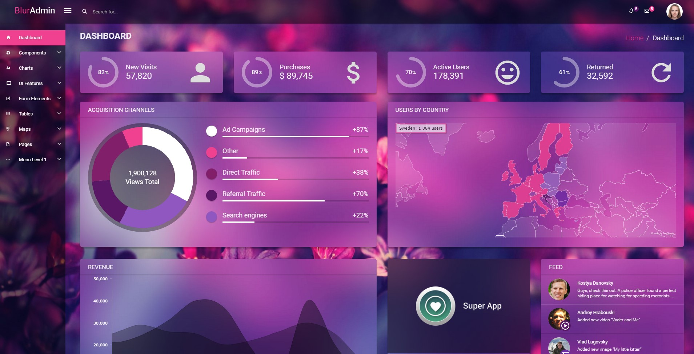

If you want to change template color scheme, you just need to do 4 simple steps:

1) Change color scheme in javascript (`src/app/theme/theme.constants.js`):
```javascript
  // main color scheme
  var colorScheme = {
    primary: '#209e91',
    info: '#2dacd1',
    success: '#90b900',
    warning: '#dfb81c',
    danger: '#e85656',
  };

  // background color palette
  var bgColorPalette = {
    blueStone: '#005562',
    surfieGreen: '#0e8174',
    silverTree: '#6eba8c',
    gossip: '#b9f2a1',
    white: '#ffffff',
  };
```
- css colors and javascript colors in colorScheme object should be the same
- background color palette is used for the pie traffic chart and calendar on the dashboard page

2) Change colors in css (`src/sass/theme/conf/_colorScheme.scss`):

```scss
$primary: #209e91 !default;
$info: #2dacd1 !default;
$success: #90b900 !default;
$warning: #dfb81c !default;
$danger: #e85656 !default;
```

3) Replace background images: `src/app/assets/img/blur-bg.jpg` and `src/app/assets/img/blur-bg-blurred.jpg`

4) build source files and run application: `gulp` and `gulp serve`

Below is an example of template with another color scheme:

